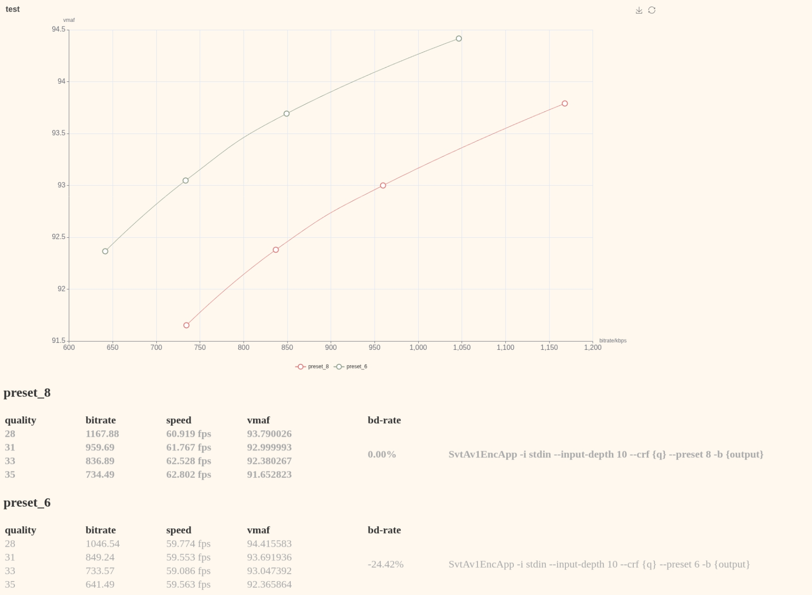

# xvctt
xyx98's video codec test tools,support various metrics.

rewrite of my [video_encoder_test_tools](https://github.com/xyx98/video_encoder_test_tools)

### Screenshot:


### Example:
``` python
from xvctt import encoders,metrics
from xvctt import mainTest

svtav1=encoders.svt_av1()

ssim=metrics.ssim()
vmaf=metrics.vmaf()

mt=mainTest(vpypath="op.vpy",title="test",metrics=[ssim,vmaf])
mt.add(encoder=svtav1,cmd='-i stdin --input-depth 10 --crf {q} --preset 8 -b {output}',qlist=[28,31,33,35],output="preset_8",workdir="av1_preset_8")
mt.add(encoder=svtav1,cmd='-i stdin --input-depth 10 --crf {q} --preset 6 -b {output}',qlist=[28,31,33,35],output="preset_6",workdir="av1_preset_6")
mt.run()
mt.genreport_all(ref=0)
```

### Requirements:
- python3.13+
- vapoursynth with plugins.
- pyecharts
- bs4
- bjontegaard

### limitations:
- Multi-Pass encoding not supported.
- Only support vapoursynth script as input.

### Todolist:
- More encoders support.
- More metrics support.
- Multi-Pass encoding support. (low priority)